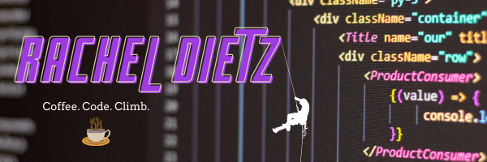

# Hello, World! 
### Glad to see you :wink:  &nbsp; 
>I'm Rachel, a soon-to-be graduating 🎓 computer science student at Rowan University. I’m currently learning 🌱 MEAN - MongoDB, Express.js, AngularJS, NodeJS. I'm passionate about learning and exploring new technologies. I love a good problem-solving challenge💡whether it be troubleshooting code 👨🏻‍💻 or trying to figure out a new route at the climbing gym 🧗. I'm currently into Web Development 🕸️ and working on building an ePortfolio 🤓. You can find me on [](https://www.linkedin.com/in/racheljdietz)

### 📊 Weekly development breakdown
<!--START_SECTION:waka-->

```text
From: 18 April 2022 - To: 25 April 2022

Java         16 hrs 8 mins   ██████████████▒░░░░░░░░░░   57.89 %
XML          5 hrs 21 mins   ████▓░░░░░░░░░░░░░░░░░░░░   19.20 %
Python       3 hrs 18 mins   ███░░░░░░░░░░░░░░░░░░░░░░   11.86 %
HTML         1 hr 41 mins    █▓░░░░░░░░░░░░░░░░░░░░░░░   06.08 %
CSS          30 mins         ▒░░░░░░░░░░░░░░░░░░░░░░░░   01.83 %
PHP          23 mins         ▒░░░░░░░░░░░░░░░░░░░░░░░░   01.40 %
```

<!--END_SECTION:waka-->


## 🔧 Technologies & Tools


## 🥇 Trophies
[](https://github.com/racheljdietz/github-profile-trophy#about-rank)

## 📈 GitHub Stats
<div>
   
  
  
</div>
